# BEMT-Based Design, Fabrication and Flight Testing of a Quadrotor UAV

  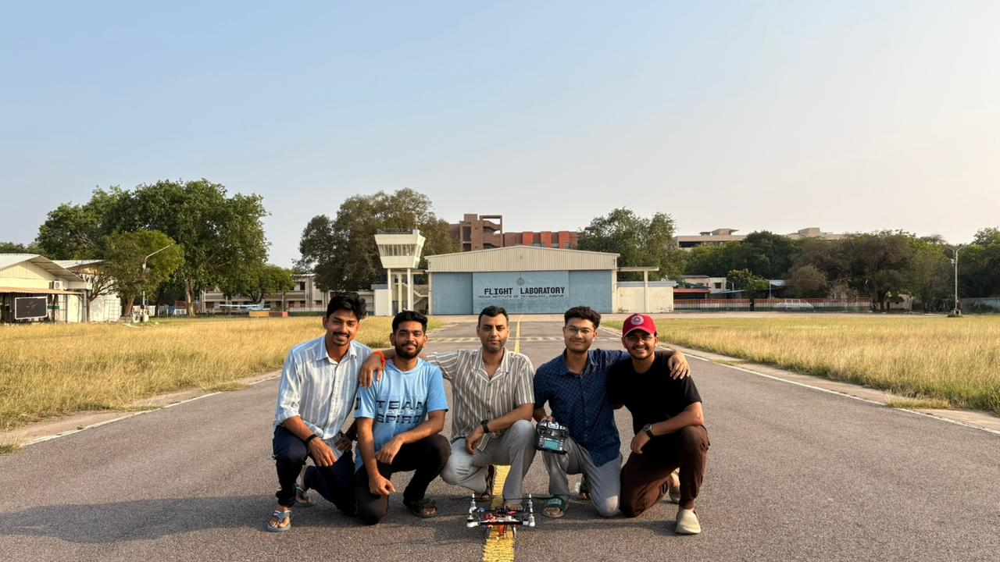

  <b>Computational Design → Component Selection → Fabrication → Bench Testing → Flight Testing</b>

---

**Course Project — Computational Aeromechanics of UAVs (AE630)**  
**Department of Aerospace Engineering, IIT Kanpur**  
**Instructor:** Dr. Navrose  
**January 2026 – April 2026**

[📄 Full Project Report](./AE630_Final_report.pdf)

## 1. Overview

This project involved the complete computational and experimental development of a small quadrotor UAV, from preliminary sizing and propulsion analysis through fabrication, ground testing, and flight testing.

The primary design requirement was to carry a **300 g payload while achieving 20 minutes of hover endurance**. A Blade Element Momentum Theory (BEMT)-based weight-optimisation tool was developed in MATLAB to determine a feasible combination of rotor geometry, motor, battery, and other vehicle parameters. :contentReference[oaicite:1]{index=1}

A parametric search was then performed over rotor radius, blade count, blade chord, root pitch, battery cell count, and motor Kv. The optimisation evaluated **47,040 design combinations**, subject to a disc-loading constraint of 40–90 N/m², and selected the feasible configuration with minimum converged Gross Take-Off Weight (GTOW). :contentReference[oaicite:2]{index=2}

The computational design was subsequently translated into a physical vehicle. Components were selected based on the optimisation results, a custom PETG frame was designed and fabricated, and the assembled vehicle was characterised through motor-propeller bench testing before being taken through flight testing.

The project therefore provided a complete design loop:

**BEMT-based sizing → optimisation → component selection → CAD → fabrication → propulsion characterisation → flight testing → flight-log analysis and refinement.**

## 2. Design Requirements

The quadrotor was designed around a primary requirement of carrying a **300 g payload while maintaining 20 minutes of hover endurance**.

The design was treated as a coupled propulsion and weight problem rather than selecting individual components independently. The major design variables considered were:

- Rotor radius
- Number of blades
- Blade chord
- Root pitch
- Motor Kv
- Battery cell count
- Battery capacity
- Vehicle structural and component masses

A practical disc-loading range of **40–90 N/m²** was imposed during the design search to constrain the solutions to a feasible rotor size and loading regime.

The objective was to identify a configuration capable of satisfying the payload and endurance requirements while minimising the converged **Gross Take-Off Weight (GTOW)**.

The resulting computational design was subsequently used as the basis for component selection and physical fabrication.

---

## 3. BEMT-Based Design & Optimisation

The propulsion system was initially sized using **Blade Element Momentum Theory (BEMT)**. A MATLAB-based tool was developed to evaluate rotor performance and its interaction with the overall vehicle weight.

For each candidate configuration, the analysis evaluated the aerodynamic performance of the rotor and propagated the resulting requirements through the propulsion and electrical systems. This allowed the effect of rotor geometry, motor selection and battery sizing to be considered together rather than in isolation.

A parametric optimisation was then performed across:

- **Rotor radius**
- **Blade count**
- **Blade chord**
- **Root pitch**
- **Motor Kv**
- **Battery cell count**

A total of **47,040 design combinations** were evaluated. Configurations violating the prescribed disc-loading range were rejected, while the remaining candidates were iterated to convergence and compared on the basis of GTOW.

The optimisation therefore established a direct link between aerodynamic sizing and vehicle-level design:

**Rotor geometry → Thrust & power → Motor selection → Battery requirement → Vehicle weight → Hover feasibility**

The resulting design point was then taken forward for component selection and physical implementation.

> **Note:** The detailed BEMT formulation, assumptions, convergence procedure, optimisation methodology and results are presented in the [Full Project Report](./AE630_Final_report.pdf).

## 4. Component Selection

The BEMT-based design established the thrust and power requirements for the propulsion system. These requirements were then used to select commercially available components capable of meeting the predicted operating point.

The major components selected were:

- **Motors**
- **Propellers**
- **Electronic Speed Controllers (ESCs)**
- **Battery**
- **Power distribution and regulation hardware**
- **Flight controller and associated avionics**

The component selection was evaluated against the computationally predicted thrust and power requirements rather than being based solely on catalogue specifications.

The final configuration was sized to provide approximately **3.1 N of thrust per motor** at the selected operating condition, giving the quadrotor sufficient total thrust to support the required vehicle weight and payload.

The resulting weight distribution is shown below.

  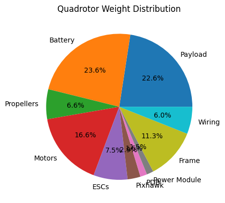

The final mass breakdown illustrates the contribution of the propulsion system, battery, structure, payload and supporting electronics to the overall vehicle weight.

The detailed component specifications, selection process and weight calculations are provided in the [Full Project Report](./AE630_Final_report.pdf).

---

## 5. CAD Design & Fabrication

Following the computational sizing and component selection, the quadrotor was developed as a complete CAD assembly.

The airframe geometry was designed to accommodate the selected propulsion system, battery, electronics and payload while maintaining a practical structural arrangement. Individual structural components were modelled and subsequently assembled to produce the final airframe.

  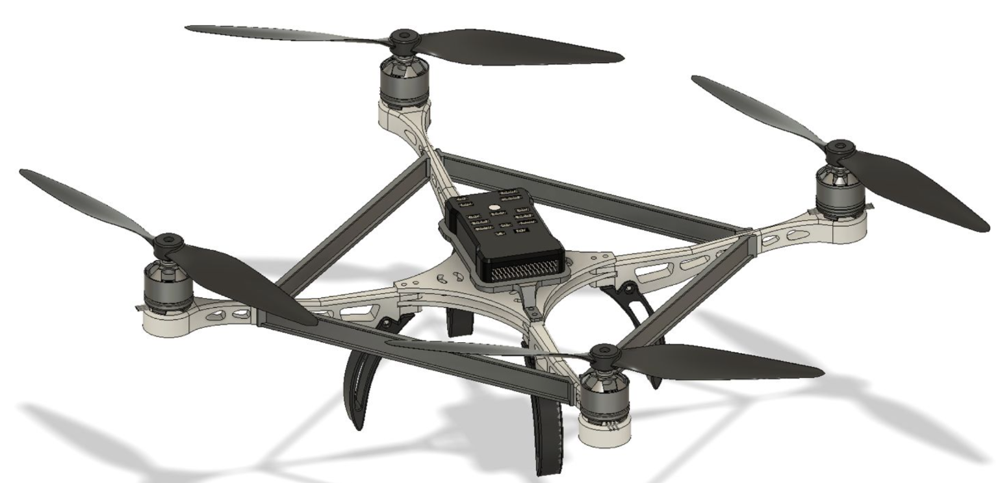

The CAD model was also used to examine the individual structural components and their interfaces before fabrication.

  

The fabricated assembly incorporated the designed arms, landing legs, motor mounts and central frame. Component placement and overall packaging were then verified against the CAD model.

  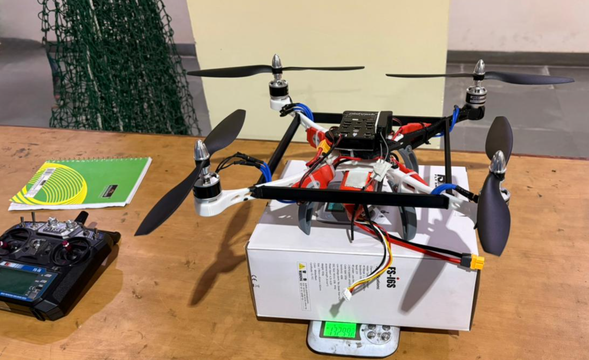

The completed vehicle was subsequently taken forward for **bench testing and experimental validation** of the propulsion system.

> **Note:** Detailed CAD dimensions, material selection, component-level design and fabrication details are presented in the [Full Project Report](./AE630_Final_report.pdf).

## 6. Bench Testing & Propulsion Validation

The fabricated propulsion system was first evaluated through a series of bench tests to compare the experimentally obtained motor-propeller performance with the requirements established during the computational design stage.

Tests were conducted over a range of motor operating conditions, with thrust, RPM and electrical power being measured. The resulting data was used to characterise the propulsion system and identify the operating point required to produce the target thrust.

### Thrust and Power Characterisation

The measured thrust increased non-linearly with motor RPM, as expected for a propeller-driven system. The required operating point of approximately **3.1 N per motor** was reached at approximately **5000 RPM**.

  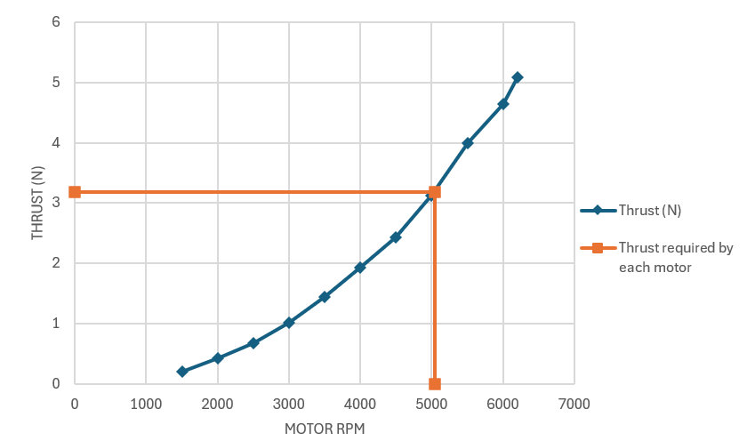

The corresponding electrical power requirement was also characterised over the tested RPM range.

  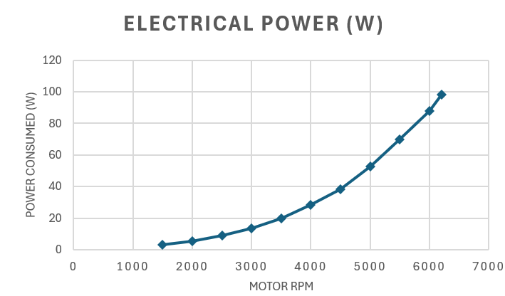

The aerodynamic power predicted from the rotor analysis was evaluated separately to assess the propulsion system performance.

  

The variation of **Figure of Merit (FM)** with RPM was also examined as a measure of rotor efficiency.

  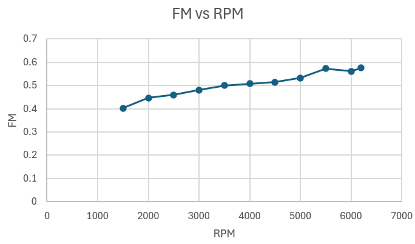

These measurements provided an experimental basis for assessing the feasibility of the computationally selected propulsion configuration before flight testing.

> **Note:** The complete bench-test methodology, instrumentation, measured data and comparison with the computational predictions are presented in the [Full Project Report](./AE630_Final_report.pdf).

---

## 7. Flight Testing & Experimental Results

Following bench validation, the completed quadrotor was subjected to flight testing to evaluate the behaviour of the integrated vehicle.

  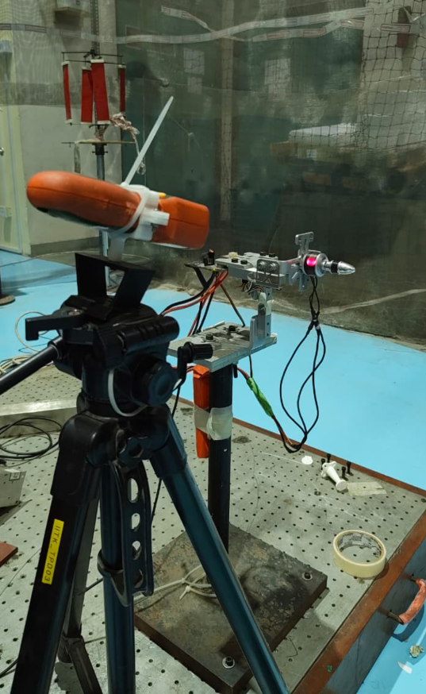

The flight-test campaign provided logged attitude and angular-rate data from the vehicle. The measured response was examined in both the time and frequency domains to characterise the behaviour of the flight-control system and the vehicle dynamics.

The roll and pitch responses were compared against their respective commanded setpoints.

### Attitude Response

  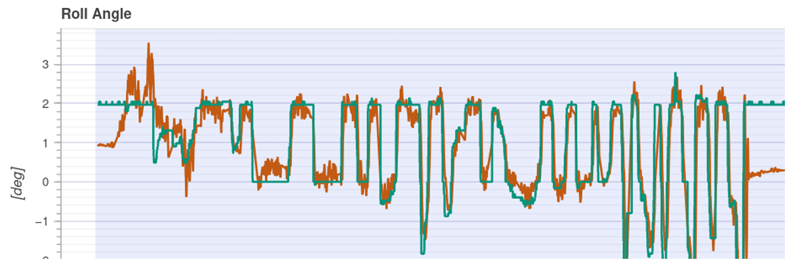

  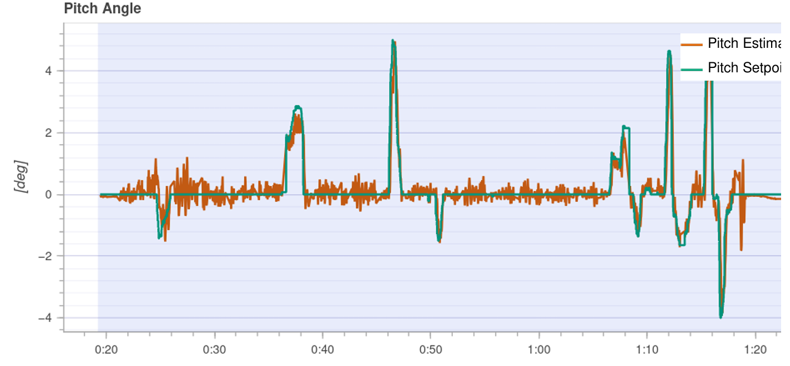

The corresponding angular-rate responses were also examined.

  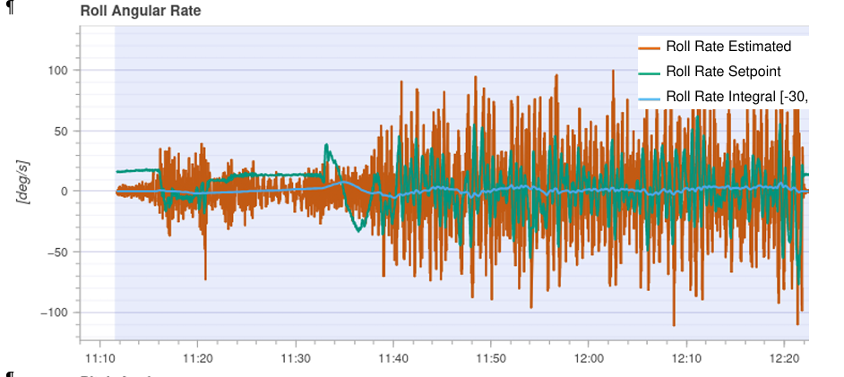

  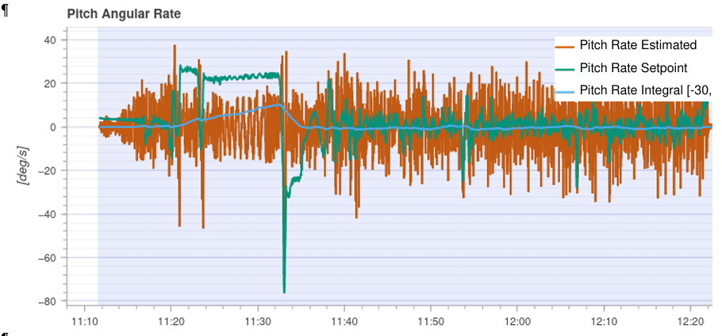

The logged data was further analysed using frequency-domain methods. The acceleration power spectral density was used to identify dominant frequency content in the measured vehicle response.

  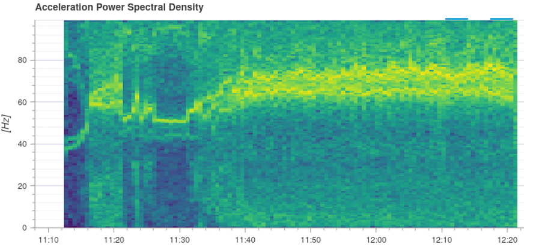

  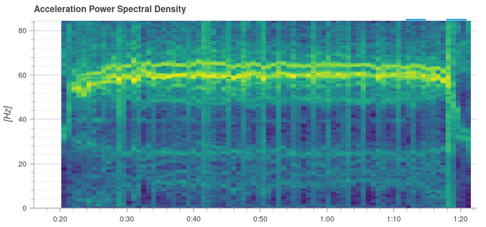

The actuator command spectrum was also examined to identify the frequency content of the control inputs and assess the contribution of high-frequency control activity.

  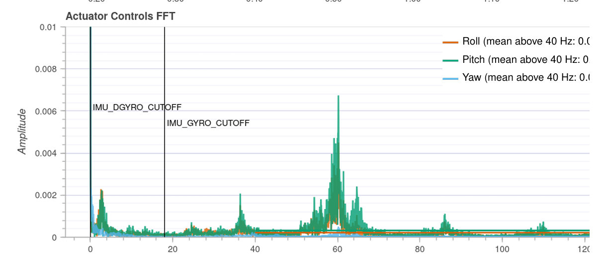

Together, these results provided experimental insight into the dynamic behaviour of the fabricated quadrotor and the performance of its flight-control system.

> **Note:** The complete flight-test setup, logged parameters, signal processing, frequency-domain analysis and interpretation of the results are provided in the [Full Project Report](./AE630_Final_report.pdf).

## 8. Design Validation

The project followed a progressively validated design workflow, beginning with computational rotor analysis and concluding with testing of the fabricated vehicle.

The propulsion design was first evaluated computationally using BEMT to establish the required rotor operating conditions. These requirements were then used for component selection and vehicle-level weight estimation.

The selected propulsion system was subsequently tested experimentally to determine its actual thrust and power characteristics. The measured results provided a direct check on whether the selected motor-propeller combination could achieve the design requirements.

The final stage was integration and flight testing of the complete quadrotor. Flight logs were analysed to examine attitude tracking, angular-rate response and the frequency content of the measured signals.

This progression allowed the design to be evaluated at multiple levels:

**BEMT Analysis → System Sizing → Component Selection → Bench Testing → Fabrication → Flight Testing**

The agreement between the computational design requirements and the experimentally demonstrated operating capability provided validation of the overall design approach.

For the complete analysis, assumptions, calculations, experimental methodology and results, refer to the [Full Project Report](./AE630_Final_report.pdf).

---

## 9. Conclusion

This project covered the complete development cycle of a small quadrotor UAV, from preliminary computational sizing to fabrication and experimental flight testing.

BEMT was used as the primary aerodynamic tool for rotor sizing and propulsion analysis, with the resulting requirements propagated into motor, propeller, ESC and battery selection. The resulting configuration was then converted into a physical airframe through CAD modelling and fabrication.

Bench testing established the experimentally achievable thrust and power characteristics of the selected propulsion system. The completed vehicle was subsequently flight tested, with logged attitude, angular-rate and frequency-domain data used to assess its dynamic response and control behaviour.

The project therefore served as an end-to-end exercise in **computational aeromechanics, UAV design, propulsion sizing, hardware integration and experimental validation**.

The detailed methodology, derivations, design iterations, test setup and complete results are documented in the **[Full Project Report](./AE630_Final_report.pdf)**.
